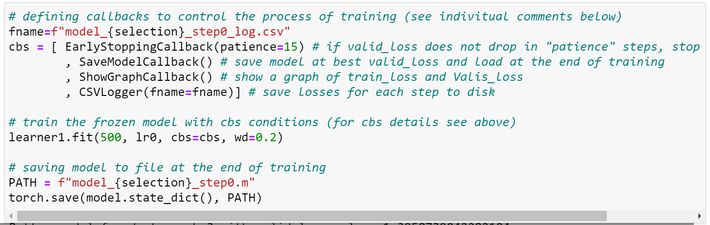
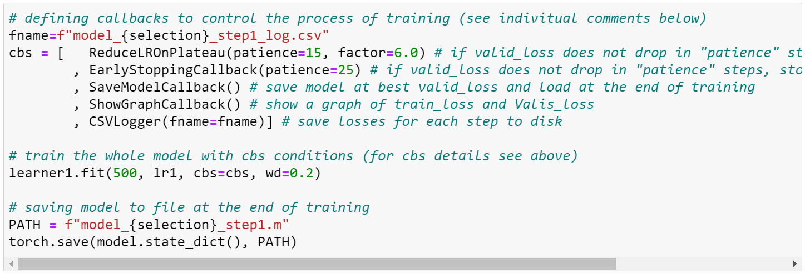

# FASTAI LIVE VIDEO LOGO OBFUSCATION
The Project aims To DETECT and OBFUSCATE specific brand logos from clothing in a live video feed. 

## Problem Statement
A lot of movies, TV shows, or music videos blur out, remove or cover out the logos and/or brand names of certain companies when they appear on screen. This is known as product displacement. 

Whenever they are including the product or service of a particular brand in their creative work, they are in one way advertising the product of that brand amongst its viewers.  Many producers often expect the brands to pay for such advertisement. But, when the brands refuse to sponsor or pay for such inclusion, the producers often blur out or remove the logo of the brand from its products. 

While it is certainly not illegal to use trademarked products in the visual media by films, TV shows, and music videos, they often resort to product displacement, for a number of reasons, ranging from ‘avoiding the legal battles’ to ‘not wanting to annoy a sponsor’.

## AWS Serverless Application Model
The AWS Serverless Application Model (SAM) is an open-source framework for building serverless applications. It provides shorthand syntax to express functions, APIs, databases, and event source mappings.
https://aws.amazon.com/serverless/sam/

## Training the Model

To train the models and test them notebooks train.ipynb and infer.ipynb (in “src/train/”) are used. The training method achieved COCO metric of 0.70 for model 3 (yolo5) and 0.42 for model 1 (retinanet).  
The training process has 3 steps: 
-	Step 0: Training the head with weight decay of 0.2.
-	Step 1: Training the whole model with weight decay of 0.2.
-	Step 2: Training the whole model without weight decay.
### Step 0 
In this step we freeze() the learner and use lr_find() to set the learning rate to min/10 recommendation. For training, weight decay of 0.2 and callbacks below are used to control and monitor progress of the training. The training will stop early if we do not have any improvement in validation loss for 15 epochs. The model is saved to disk after each step. SaveModelCallback() is used to load the best model found at the end.

### Step 1
In this step we unfreeze() the leaner. lr_find() is run again but at this step, normally, its results are not informative. It is recommended that user set this learning rate manually. One tenth of the learning rate of step0 usually works well. Callbacks below are used to drop learning rate by factor of 6 after 15 steps without progress and to stop after 25 steps without any progress. 

### Step 2
In this step we remove the weight decay. It is again recommended that user set the learning rate manually to the largest possible value that does not deteriorate the validation loss of the previous step. Same Callbacks as step 1 are used to drop learning rate by factor of 6, after 15 steps without progress and stop after 25 steps without any progress. 
