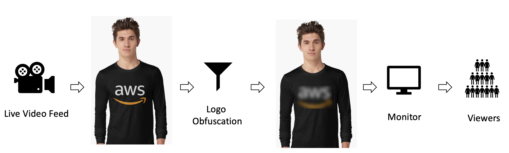

# FASTAI LIVE VIDEO LOGO OBFUSCATION
The Project aims To DETECT and OBFUSCATE specific brand logos from clothing in a live video feed. 

## Problem Statement
A lot of movies, TV shows, or music videos blur out, remove or cover out the logos and/or brand names of certain companies when they appear on screen. This is known as product displacement. 

Whenever they are including the product or service of a particular brand in their creative work, they are in one way advertising the product of that brand amongst its viewers.  Many producers often expect the brands to pay for such advertisement. But, when the brands refuse to sponsor or pay for such inclusion, the producers often blur out or remove the logo of the brand from its products. 

While it is certainly not illegal to use trademarked products in the visual media by films, TV shows, and music videos, they often resort to product displacement, for a number of reasons, ranging from ‘avoiding the legal battles’ to ‘not wanting to annoy a sponsor’.



## Training the Model
To train the models and test them notebooks train.ipynb and infer.ipynb (in “src/train/”) are used. The training method achieved COCO metric of 0.70 for model 3 (yolo5) and 0.42 for model 1 (retinanet).  
The training process has 3 steps:
-	Step 0: Training the head with weight decay of 0.2.
-	Step 1: Training the whole model with weight decay of 0.2.
-	Step 2: Training the whole model without weight decay.
### Step 0
In this step we freeze() the learner and use lr_find() to set the learning rate to min/10 recommendation. For training, weight decay of 0.2 and callbacks below are used to control and monitor progress of the training. The training will stop early if we do not have any improvement in validation loss for 15 epochs. The model is saved to disk after each step. SaveModelCallback() is used to load the best model found at the end.

```python
# defining callbacks to control the process of training (see indivitual comments below)
fname=f"model_{selection}_step0_log.csv"
cbs = [ EarlyStoppingCallback(patience=15) # if valid_loss does not drop in "patience" steps, stop training early
        , SaveModelCallback() # save model at best valid_loss and load at the end of training 
        , ShowGraphCallback() # show a graph of train_loss and Valis_loss
        , CSVLogger(fname=fname)] # save losses for each step to disk

# train the frozen model with cbs conditions (for cbs details see above)
learner1.fit(500, lr0, cbs=cbs, wd=0.2) 

# saving model to file at the end of training
PATH = f"model_{selection}_step0.m"
torch.save(model.state_dict(), PATH)
```

### Step 1
In this step we unfreeze() the leaner. lr_find() is run again but at this step, normally, its results are not informative. It is recommended that user set this learning rate manually. One tenth of the learning rate of step0 usually works well. Callbacks below are used to drop learning rate by factor of 6 after 15 steps without progress and to stop after 25 steps without any progress.

```python
# defining callbacks to control the process of training (see indivitual comments below)
fname=f"model_{selection}_step1_log.csv"
cbs = [   ReduceLROnPlateau(patience=15, factor=6.0) # if valid_loss does not drop in "patience" steps, drop lr by factor of 10
        , EarlyStoppingCallback(patience=25) # if valid_loss does not drop in "patience" steps, stop training early
        , SaveModelCallback() # save model at best valid_loss and load at the end of training 
        , ShowGraphCallback() # show a graph of train_loss and Valis_loss
        , CSVLogger(fname=fname)] # save losses for each step to disk

# train the whole model with cbs conditions (for cbs details see above)
learner1.fit(500, lr1, cbs=cbs, wd=0.2)

# saving model to file at the end of training
PATH = f"model_{selection}_step1.m"
torch.save(model.state_dict(), PATH)
```

### Step 2
In this step we remove the weight decay. It is again recommended that user set the learning rate manually to the largest possible value that does not deteriorate the validation loss of the previous step. Same Callbacks as step 1 are used to drop learning rate by factor of 6, after 15 steps without progress and stop after 25 steps without any progress.

## Examples:
Model 3:


Model 3:


Model 1:


## Run your own Logo Obfuscator 

*Dataset*: To train and perform inference on our models we first need data for model training. 

### Environment setup
We will use [conda](https://docs.conda.io/projects/conda/en/latest/user-guide/install/) 
to create our environment. Create a python 3.8 environment first: 

``` text
conda create -n py38 python=3.8 
```

Activate the environment: 

```text
conda activate py38
```

Then install dependencies: 

``` text
pip3 install -r requirements.txt 
```

## Training your own model 
Run `train.py` (im guessing we'll have a training script?). This will generate a model saved to a specified directory. 

``` 
python -m  src.train --data-dir {TRAINING_DATA_DIR} --model-save-dir {MODEL_SAVE_PATH} 
```

## Inference
We can run inference on our 
[trained models](https://drive.google.com/drive/folders/1v0xAoCK1cuZmud-jKuSzE_CUC4ZIj8vX), 
or provide a path to your own trained model: 

```
python -m src.inference --model-number {MODEL_NUMBER} --model-path {PATH_TO_MODEL}
```

## Webcam client 
To run obfuscation live on your webcam: 

``` 
python -m  src.webcam_client.webcam_client --model-number {MODEL_NUMBER} --model-path {PATH_TO_MODEL}
```

Adjustments can be made to the running webcam client to toggle bounding boxes, switch out models and change the 
frame rate of the stream: 

_insert a screenshot here !_

We have only trained our provided models with Nike logos for the time being. 
So make sure you have a Nike logo ready!

## End-to-end notebook
If you're a more interactive person, or you like experimenting, see __ in notebooks 
to view the training and inference code end-to-end.
